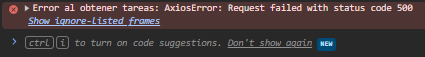
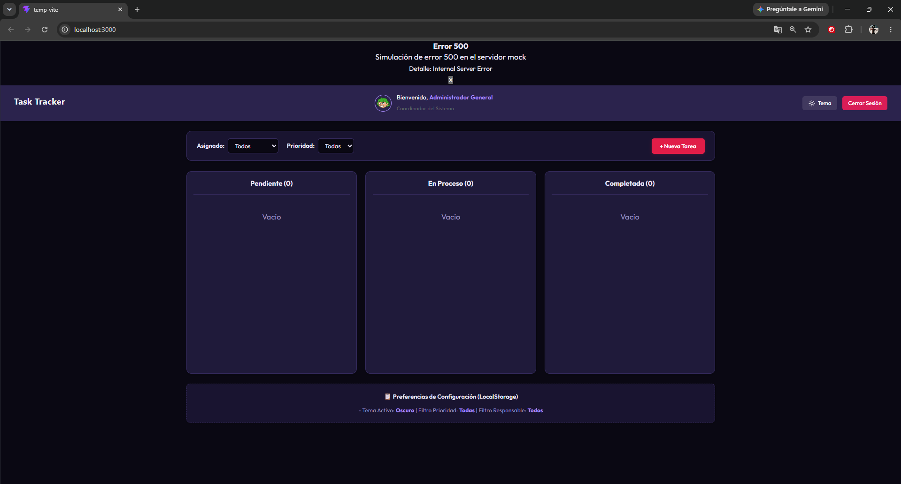

# Evidencias de Pruebas de Red y Manejo de Errores - INACAP ES3

## Lógica de Control de Excepciones Implementada

El manejo de errores se diseñó utilizando un patrón de **Interceptor Global** y **Mensajería por Eventos** para desacoplar el canal de comunicación de la interfaz de usuario:

1. **Interceptor de Axios (`axiosInstance.js`):**
   * Configura un interceptor de respuestas (`axiosInstance.interceptors.response.use`).
   * En caso de fallas (dentro del bloque `catch`), captura el objeto `error.response`.
   * Lee el código de estado (`status`) y el mensaje descriptivo retornado por el servidor.
   * Despacha un evento personalizado de JavaScript (`CustomEvent`) llamado `'api-error'` directamente en el objeto global `window`, transportando los datos del error.

2. **Componente de Notificación Visual (`ErrorAlert.jsx`):**
   * Se monta de manera global en `App.jsx` al inicio de la aplicación.
   * Utiliza un Hook `useEffect` para registrar un receptor de eventos (`window.addEventListener('api-error', ...)`).
   * Al recibir el evento, extrae la información del error y despliega un Toast flotante en color rojo.
   * Implementa una cuenta regresiva para auto-desvanecerse después de 5 segundos sin bloquear el hilo principal.

---

## Capturas de Evidencia

### 1. Error 401 - Unauthorized (Credenciales Incorrectas)
Se gatilla al ingresar credenciales inválidas en el formulario de inicio de sesión o al intentar consultar recursos protegidos sin una cabecera de autorización válida.

* **Evidencia en Consola:**
  

* **Evidencia en Interfaz:**
  

---

### 2. Error 500 - Internal Server Error (Falla del Servidor)
Se simula agregando el parámetro de consulta `?error=500` a las peticiones del tablero de tareas.

* **Evidencia en Consola:**
  

* **Evidencia en Interfaz:**
  

---

### 3. Error 404 - Not Found (Recurso no Encontrado)
Se gatilla al intentar consultar los detalles de una tarea con un identificador (ID) que no existe en la base de datos del servidor mock.

* **Evidencia en Consola:**
  

* **Evidencia en Interfaz:**
  
