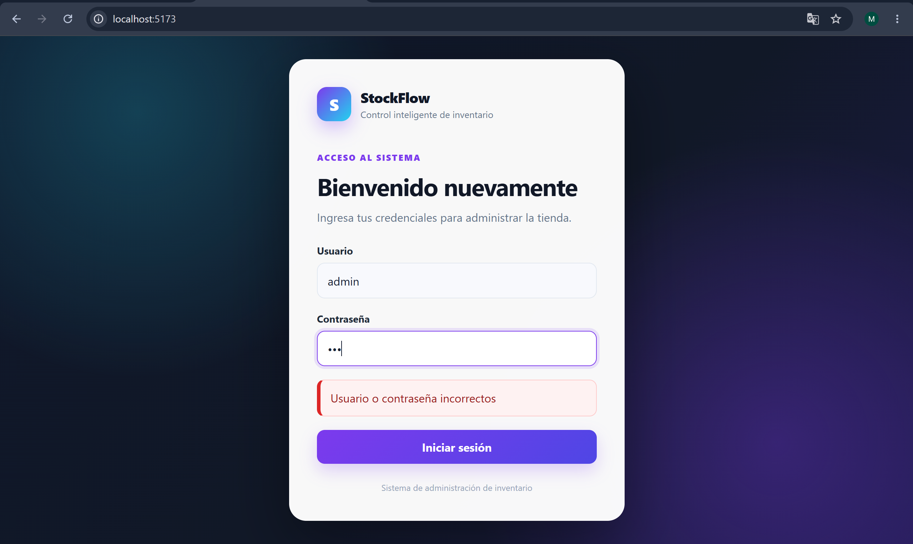
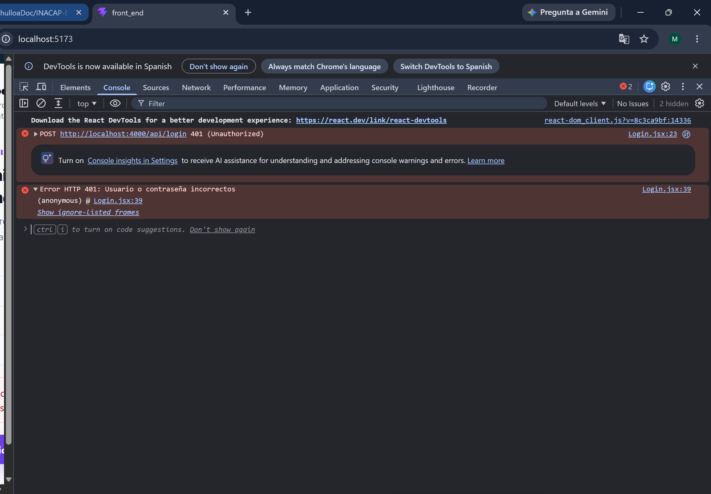
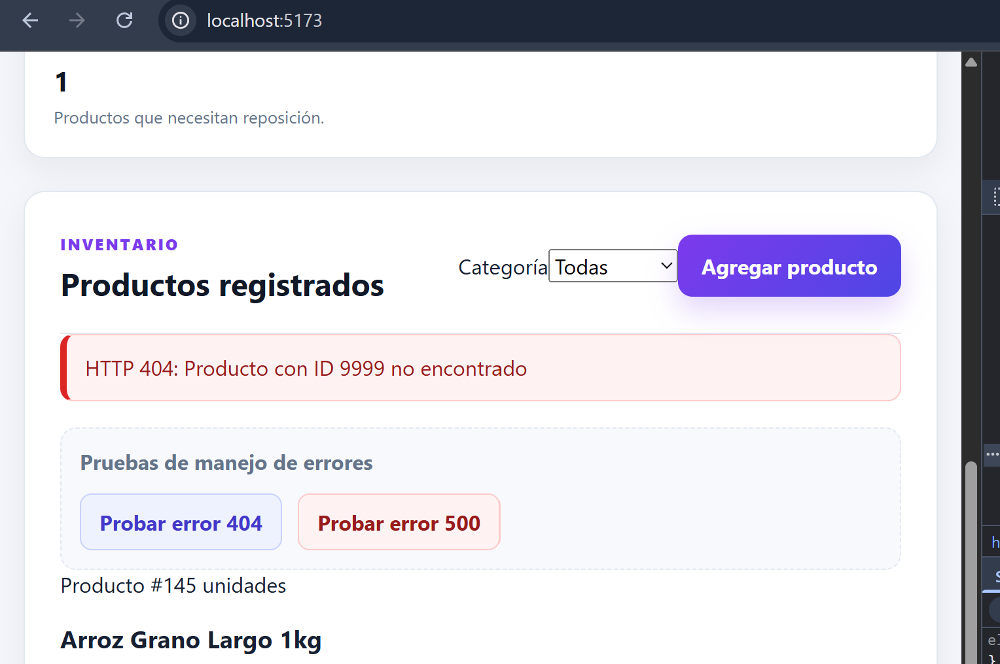
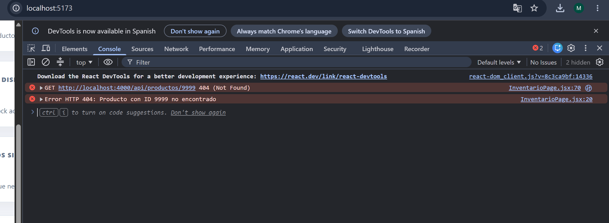

# Evidencias de manejo de errores

En esta carpeta se encuentran las capturas que demuestran el manejo de los errores HTTP 401, 404 y 500 en la aplicación StockFlow.

Los errores fueron controlados con Axios, bloques `try/catch` y el componente reutilizable `ErrorAlert`. De esta forma, la aplicación muestra un mensaje al usuario y continúa funcionando sin cerrarse ni congelarse.

---

## Error 401 — Credenciales incorrectas

Este error se produce cuando se intenta iniciar sesión con un usuario o contraseña incorrectos.

El bloque `catch` de `Login.jsx` obtiene el código y el mensaje enviado por la API. Después, registra el error en la consola y muestra una alerta dentro del formulario.

### Evidencia en la interfaz



### Evidencia en la consola



---

## Error 404 — Producto no encontrado

Este error se produce al consultar el producto con ID `9999`, el cual no existe en la API.

La solicitud se realiza con Axios. El bloque `catch` obtiene el código 404 y muestra el mensaje mediante el componente `ErrorAlert`.

### Evidencia en la interfaz



### Evidencia en la consola



---

## Error 500 — Error interno simulado

Este error se genera enviando la cabecera:

```text
x-simulate-error: 500