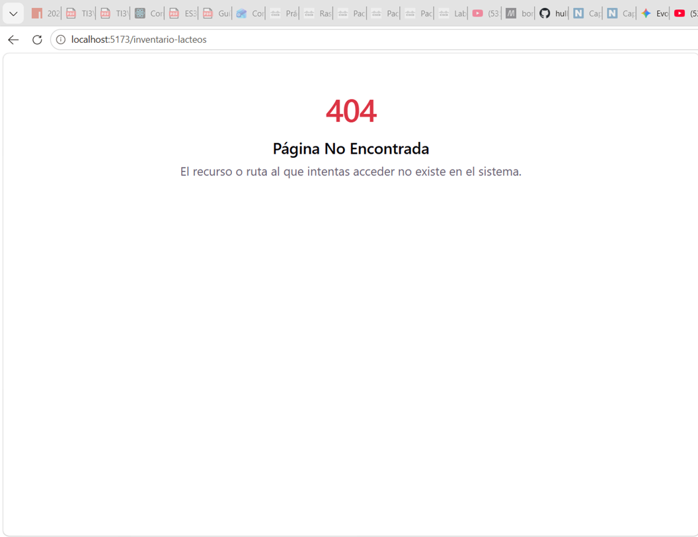
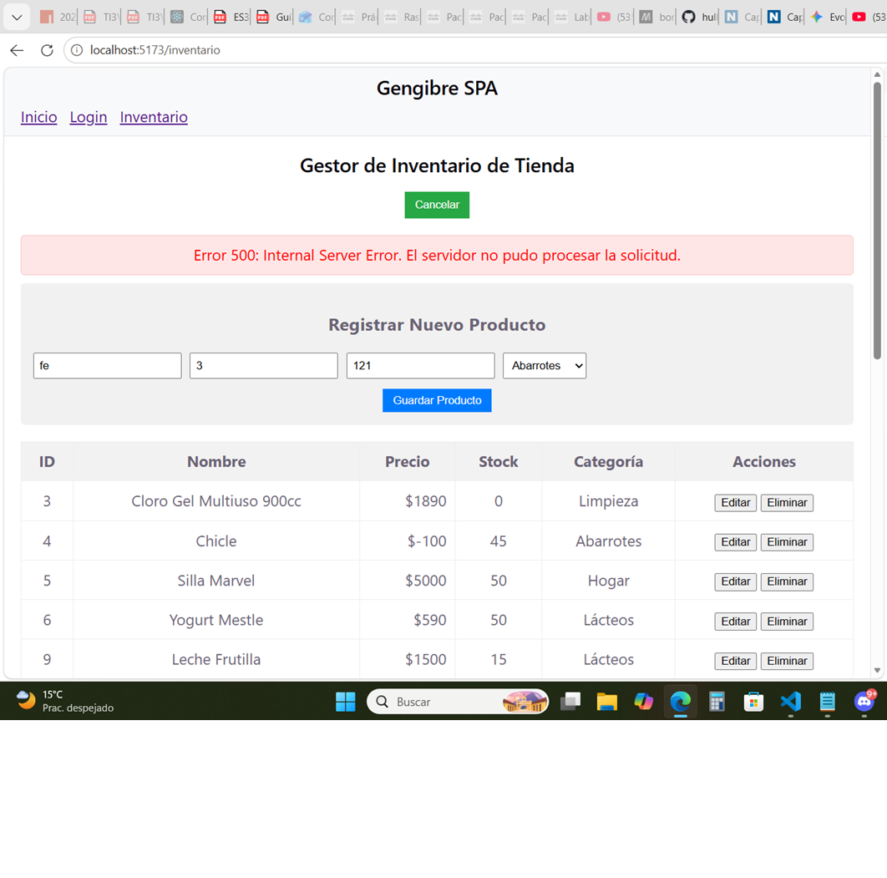
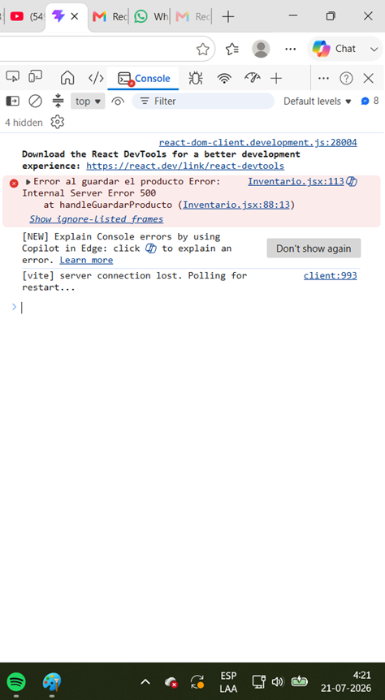

Este directorio contiene las capturas de pantalla de la consola y la interfaz de usuario requeridas para evidenciar el correcto manejo de errores HTTP asíncronos mediante Axios, así como la documentación de la lógica implementada en los bloques `catch`.

## 1. Error 401: Unauthorized (Acceso No Autorizado)

### Captura de Interfaz

### Captura de Consola

### Explicación Lógica del Bloque Catch
En los componentes encargados de consumir recursos protegidos (como el listado de productos en `Inventario.jsx`), se implementó un bloque `try...catch` asíncrono junto con una instancia centralizada de Axios. Cuando el servidor mock detecta que la petición se realiza sin una cabecera de autenticación válida (o sin un token activo en el `localStorage`), responde con un código de estado HTTP `401`.

La estructura del bloque `catch` captura este rechazo de la promesa, registra el error técnico en la consola mediante `console.error(err)` para fines de depuración, y actualiza el estado local del componente (`setError`) para mostrar de forma dinámica un componente o mensaje de alerta visual en la interfaz del usuario (`"Error al cargar el inventario desde el servidor"`), evitando así que la aplicación SPA colapse o se congele.

## 2.Error 404: Not Found (Ruta no encontrada)

### Captura de Consola

### Explicación lógica del Bloque Catch
Este error se gestiona en las operaciones puntuales sobre recursos individuales (como al intentar editar, eliminar o buscar un producto mediante su ID en `/api/productos/:id`). Cuando el servidor mock responde con un código `404` al no encontrar el registro solicitado, el bloque `catch` intercepta la excepción generada por Axios. 

En la lógica implementada, se extrae el mensaje proporcionado por la respuesta del servidor (`error.response?.data?.message`) para asignarlo al estado de error del componente (`setMensajeError`). Esto permite renderizar una alerta visual de advertencia en la interfaz que le indica claramente al administrador que el registro ya no existe o fue previamente eliminado, permitiendo que la aplicación continúe operando de forma fluida.

## 3.Error 500: Internal Server Error (Error Interno)

### Captura de Interfaz

### Captura de Consola

### Explicación Lógica del Bloque Catch
Este escenario evalúa la resiliencia del sistema ante fallas críticas del lado del servidor. Cuando el servidor mock responde con un código de estado `500`, la promesa de Axios es rechazada y el control fluye directamente hacia el bloque `catch`.

La implementación extrae el mensaje de error del servidor a través de `error.response?.data?.message` o despliega un mensaje predeterminado de respaldo ("Error interno del servidor"). Este texto se asigna al estado visual de errores (`setMensajeError`), renderizando un componente de alerta destacado en la interfaz. De este modo, se informa al usuario de la falla de manera controlada y se evita el bloqueo total o congelamiento de la SPA.