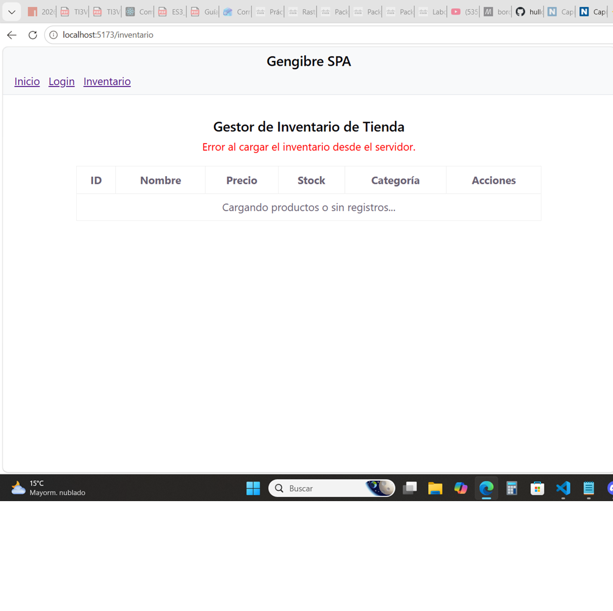
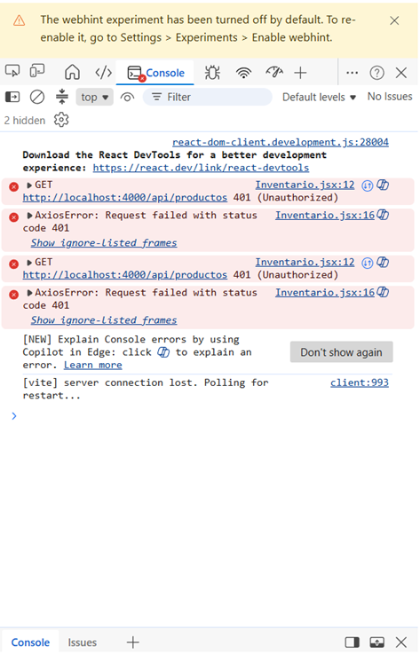

Este directorio contiene las capturas de pantalla de la consola y la interfaz de usuario requeridas para evidenciar el correcto manejo de errores HTTP asíncronos mediante Axios, así como la documentación de la lógica implementada en los bloques `catch`.

## 1. Error 401: Unauthorized (Acceso No Autorizado)

### Captura de Interfaz

### Captura de Consola

### Explicación Lógica del Bloque Catch
En los componentes encargados de consumir recursos protegidos (como el listado de productos en `Inventario.jsx`), se implementó un bloque `try...catch` asíncrono junto con una instancia centralizada de Axios. Cuando el servidor mock detecta que la petición se realiza sin una cabecera de autenticación válida (o sin un token activo en el `localStorage`), responde con un código de estado HTTP `401`.

La estructura del bloque `catch` captura este rechazo de la promesa, registra el error técnico en la consola mediante `console.error(err)` para fines de depuración, y actualiza el estado local del componente (`setError`) para mostrar de forma dinámica un componente o mensaje de alerta visual en la interfaz del usuario (`"Error al cargar el inventario desde el servidor"`), evitando así que la aplicación SPA colapse o se congele.